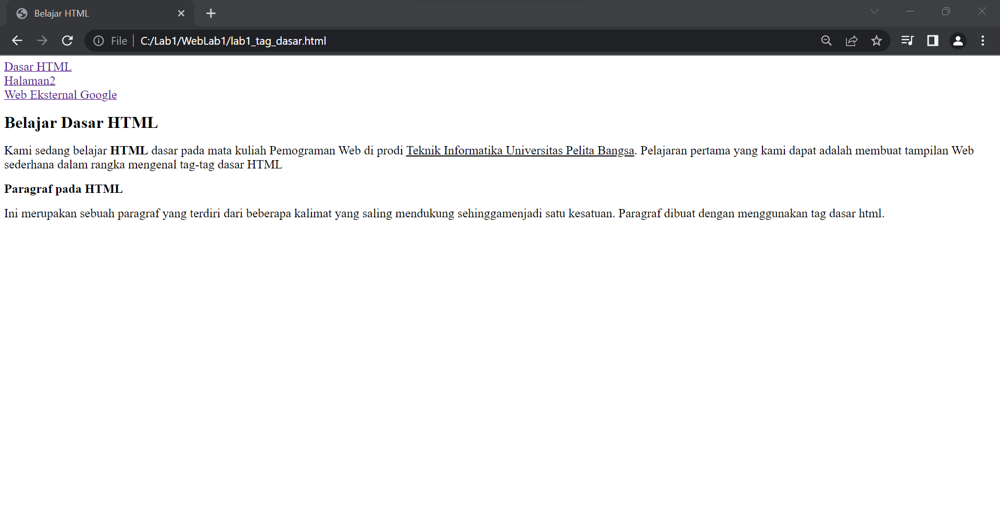
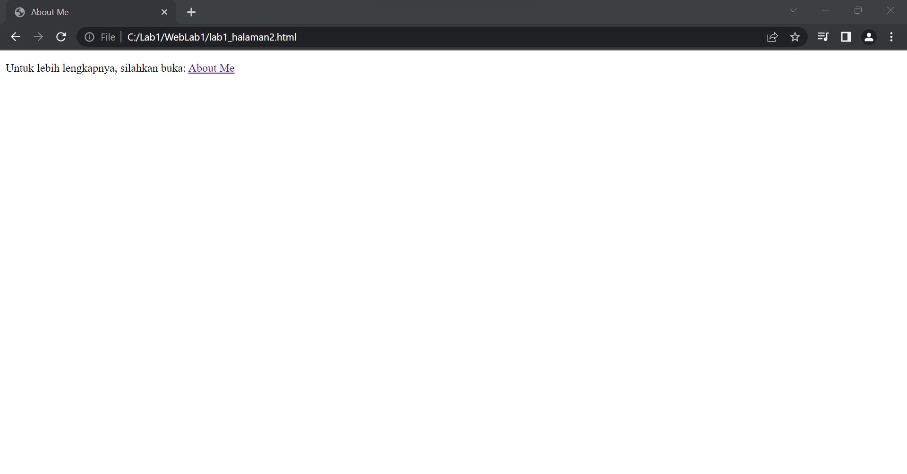

# WebLab1
## Belajar Tag Dasar HTML

### Membuat Paragraf
Attribut untuk tag paragraf adalah `
` dan untuk attribut tag `<title>` bergungsi untuk menembahkan judul pada paragraf

#### Hasil tampilan attribut tag paragraf

### Memformat Teks
Attribut tag format ada beberapa attribut yang dapat digunakan pada format teks
`<b>` berfungsi untuk menebalkan teks `<u>` berfungsi untuk memiringkan teks

##### Hasil tampilan menggunakan attribut format teks

### Menyisipkan Gambar
Untuk menyisipkan gambar pada halaman HTML simpan file gambar satu folder dengan halaman HTML atau bisa juga menyisipkan gambar dari web eksternal
buat telebih dahulu sub judul untuk gambar yang akan disisipkan dengan attribut dan untuk mengatur tinggi dan lebar gambar bisa menggunakan widht dan height

`<h3>Menambahkan Gambar</h3>`

``

### Menambahkan Hyperlink
Untuk menambahkan hyperlink pada halaman HTML menggunakan attribut tag `<nav>` pertama kita buat terlebih dahulu file html baru yang ingin di direct di folder yang sama dengan pada halaman html pertama
`<nav>` 

`<a href="filehtml1">Dasar HTML</a>`

`<a href="halamanhtmlyangdidirect">Halaman 2</a>`

`<a href="http://www.google.com">Halaman Web Eksternal Google</a>`

`</nav>`

#### Hasil Tampilan attribut tag Hyperlink

#### Hasil direct ke link yang dibuat

#### Jawab Pertanyaan Berikut
1. Lakukan perubahan pada kode sesuai dengan keinginan anda, amati perubahannya adakah error ketika terjadi kesalahan penulisan tag ?
2. Apa perbedaan dari tag `
` dengan tag ` `, berikan penjelasannya !
3. Apa perbedaan atribut title dan alt pada tag , berikan penjelasannya !
4. Untuk mengatur ukuran gambar, digunakan atribut width dan height. Agar tampilan gambar proporsional sebaiknya kedua atribut tersebut diisi semua atau tidak Berikan penjelasannya !
5. Pada link tambahkan atribut target dengan nilai atribut bervariasi ( _blank, _self, _top, _parent ), apa yang terjadi pada masing-masing nilai antribut tersebut ?

#### Jawab
1. Pasti terjadi error jika ada kesalahan pada penulisan tag karena program tidak bisa memebedakan mana tag mana attribut
2. Tag paragraph `
` dimulai dan diakhiri dengan tag penutup `
` sebagai akhir dari sebuah paragraph dan akan memasuki baris baru. Sedangkan pada tag ` ` juga memiliki fungsi yang sama, yakni untuk membuat paragraph baru atau barisan baru.
3. `<title>` Title image adalah atribut lain yang dapat ditambahkan ke tag gambar dalam HTML. Title image ini digunakan untuk memberikan judul untuk gambar Anda. Text yang Anda masukkan di dalam tag judul tidak akan ditampilkan kepada pengguna ketika gambar tidak dapat ditampilkan. Sebaliknya, tag judul gambar ini ditampilkan saat Anda menyorot gambar dengan mouse.
    `<alt>` Alt text atau text alternatif adalah atribut yang ditambahkan ke tag gambar dalam HTML. Teks ini muncul di dalam wadah gambar ketika gambar tidak dapat ditampilkan. Ini membantu mesin pencari memahami apa isi dari gambar tersebut. Text alternatif juga sangat membantu dalam kasus gambar yang tidak ditemukan pada halaman atau gambar rusak, lihat seperti gambar dibawah ini.

