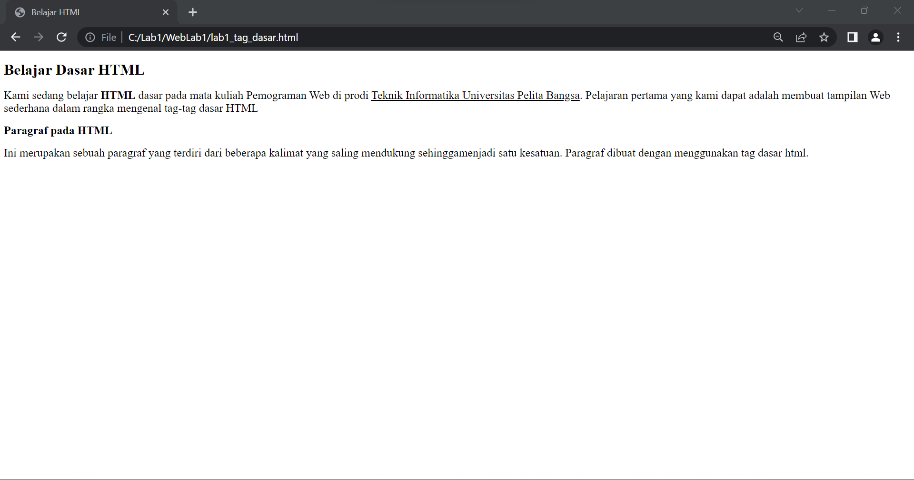
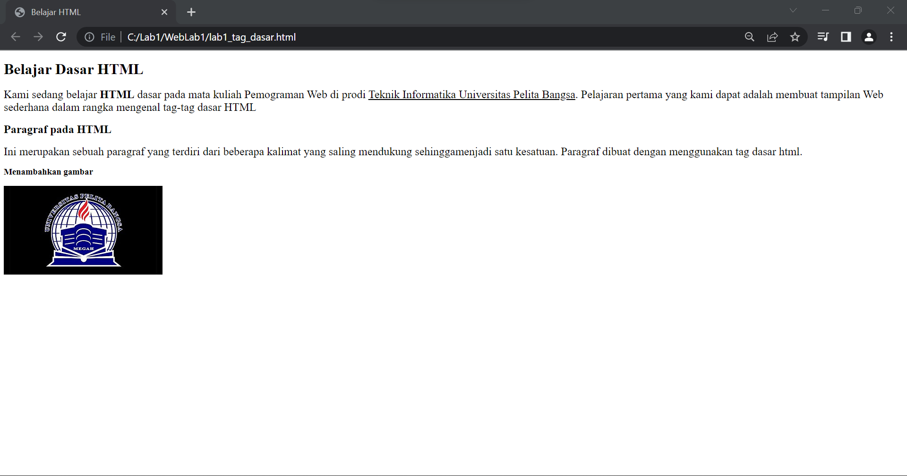

# WebLab1
## Belajar Tag Dasar HTML

### Membuat Paragraf
Attribut untuk tag paragraf adalah `
` dan untuk attribut tag `<title>` bergungsi untuk menembahkan judul pada paragraf

#### Hasil tampilan attribut tag paragraf

### Memformat Teks
Attribut tag format ada beberapa attribut yang dapat digunakan pada format teks
`<b>` berfungsi untuk menebalkan teks `<u>` berfungsi untuk memiringkan teks

##### Hasil tampilan menggunakan attribut format teks

### Menyisipkan Gambar
Untuk menyisipkan gambar pada halaman HTML simpan file gambar satu folder dengan halaman HTML atau bisa juga menyisipkan gambar dari web eksternal
buat telebih dahulu sub judul untuk gambar yang akan disisipkan dengan attribut 

`<h3>Menambahkan Gambar</h3>`

``

